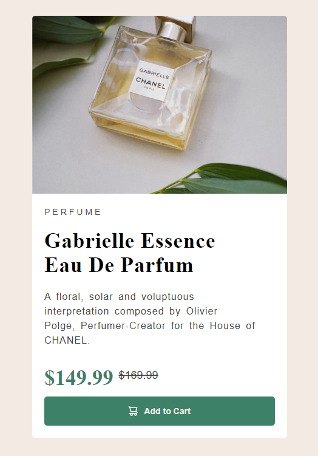

<h1 align="center"> Projeto Sale Perfume Page </h1>

Projeto criado por mim.

  <a href="#-tecnologias">Tecnologias</a>&nbsp;&nbsp;&nbsp;|&nbsp;&nbsp;&nbsp;
  <a href="#-projeto">Projeto</a>&nbsp;&nbsp;&nbsp;|&nbsp;&nbsp;&nbsp;
  <a href="#-licença">Licença</a>

  

 

  

## 🚀 Tecnologias

Esse projeto foi desenvolvido com as seguintes tecnologias:

- HTML e CSS
- Git e Github
- Figma

## 💻 Projeto

O projeto Sale Perfume Page é um projeto que pode ser utilizado como página de vendas para perfumes ou para qualquer outro produto, nele contêm uma imagem do produto, nome, descrição e o valor, na parte inferior temos o botão de compra ounde pode ser interligado com JavaScript e termos realmente a função de comprar, visto que nesse projeto essa função ainda não é possível. Acesse o projeto [AQUI](https://yuriverwiebe.github.io/sale-perfume-page)

## 📝 Licença

Esse projeto está sob a licença MIT.

---

Feito com ♥ by Yuri Verwiebe 🌊
